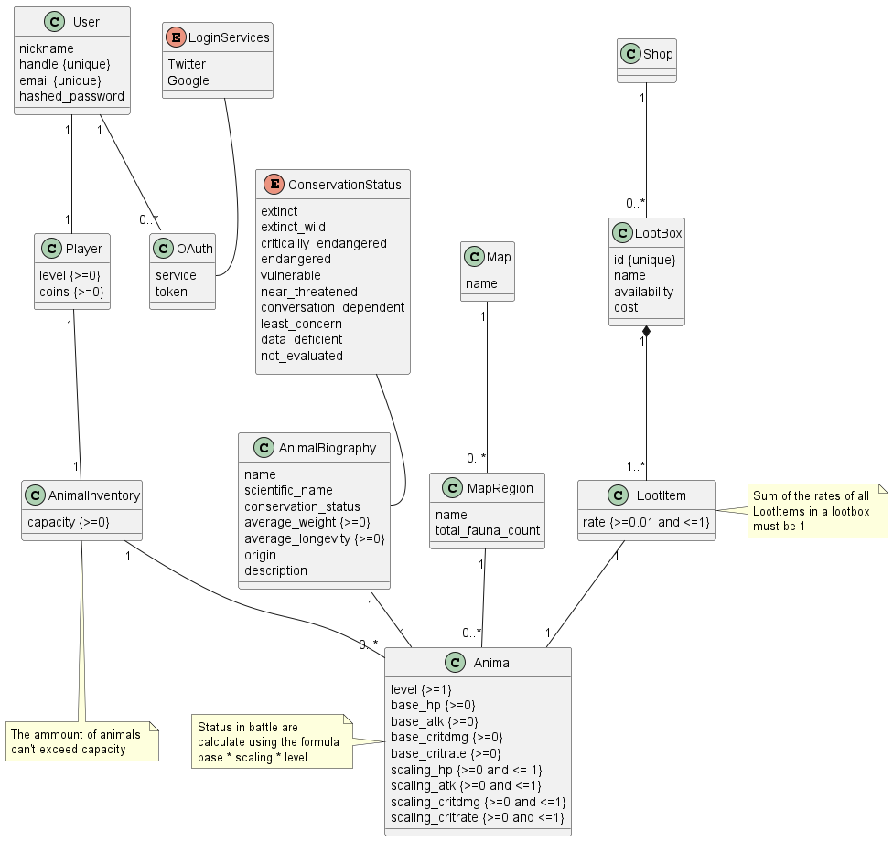

<!-- Template file for README.md for LEIC-ES-2023-24 -->

# _BioCatcher_ Development Report

Welcome to the documentation pages of the _BioCatcher_!

You can find here details about the _BioCatcher_, from a high-level vision to low-level implementation decisions, a kind of Software Development Report, organized by type of activities: 

* [Business modeling](#Business-Modelling) 
  * [Product Vision](#Product-Vision)
  * [Features and Assumptions](#Features-and-Assumptions)
  * [Elevator Pitch](#Elevator-pitch)
* [Requirements](#Requirements)
  * [User stories](#User-stories)
  * [Domain model](#Domain-model)
* [Architecture and Design](#Architecture-And-Design)
  * [Logical architecture](#Logical-Architecture)
  * [Physical architecture](#Physical-Architecture)
  * [Vertical prototype](#Vertical-Prototype)
* [Project management](#Project-Management)

Made by:

 - Ismael Moniz - up202206871@up.pt
 - Gabriel Lima - up202206693@up.pt
 - Francisco Bettencourt - up202105288@up.pt
 - Francisco Fernandes - up202104843@up.pt
 - Luís Fiunte - up202208819@up.pt

---
## Business Modelling

### Product Vision

Learning about animals made fun, we bring nature to your fingertips.

### Features and Assumptions

#### Features

- Login - Allows the user to keep their progress
- Battle - Allows the user to engage in battles between animals
- BioDex - Stores the user's animals and shows their characteristics
- Lootboxes - Box opening system to collect animals (gambling mechanic)
- Interactive map - Map of Portugal divided by regions where you can check their respective fauna and look up your completion for each region.
- Animal cards - Each animal has a card that gives information about their stats, level and general information about conservation status, average weight, longevity, etc.

#### Dependencies

- Google Oauth - easier login to the platform
- OpenMap
- Twitter API

### Elevator Pitch
Embark on an adventure to discover Portugal's rich biodiversity with BioCatcher, the app that turns our native fauna into an exciting journey. From the majestic iberian lynx to the slender lusitanian salamander, embark on quests to collect  and learn more about the creatures that hide in Portugal's forests, rivers and seas. But it's more than a game - it's a platform where everyone can learn and educate themselves about wildlife and contribute to conservation efforts while having fun! There are so many interesting animals to discover, come and start your journey now!

## Requirements

### User stories

[Go to board](https://github.com/orgs/FEUP-LEIC-ES-2023-24/projects/4/)

### Domain model

 

  

## Architecture and Design
The architecture of a software system encompasses the set of key decisions about its overall organization. 

A well written architecture document is brief but reduces the amount of time it takes new programmers to a project to understand the code to feel able to make modifications and enhancements.

To document the architecture requires describing the decomposition of the system in their parts (high-level components) and the key behaviors and collaborations between them. 

In this section you should start by briefly describing the overall components of the project and their interrelations. You should also describe how you solved typical problems you may have encountered, pointing to well-known architectural and design patterns, if applicable.

### Logical architecture
The purpose of this subsection is to document the high-level logical structure of the code (Logical View), using a UML diagram with logical packages, without the worry of allocating to components, processes or machines.

It can be beneficial to present the system in a horizontal decomposition, defining layers and implementation concepts, such as the user interface, business logic and concepts.

Example of _UML package diagram_ showing a _logical view_ of the Eletronic Ticketing System (to be accompanied by a short description of each package):

### Physical architecture
The goal of this subsection is to document the high-level physical structure of the software system (machines, connections, software components installed, and their dependencies) using UML deployment diagrams (Deployment View) or component diagrams (Implementation View), separate or integrated, showing the physical structure of the system.

It should describe also the technologies considered and justify the selections made. Examples of technologies relevant for ESOF are, for example, frameworks for mobile applications (such as Flutter).

Example of _UML deployment diagram_ showing a _deployment view_ of the Eletronic Ticketing System (please notice that, instead of software components, one should represent their physical/executable manifestations for deployment, called artifacts in UML; the diagram should be accompanied by a short description of each node and artifact):

### Vertical prototype
To help on validating all the architectural, design and technological decisions made, we usually implement a vertical prototype, a thin vertical slice of the system integrating as much technologies we can.

In this subsection please describe which feature, or part of it, you have implemented, and how, together with a snapshot of the user interface, if applicable.

At this phase, instead of a complete user story, you can simply implement a small part of a feature that demonstrates thay you can use the technology, for example, show a screen with the app credits (name and authors).

## Project management
Software project management is the art and science of planning and leading software projects, in which software projects are planned, implemented, monitored and controlled.

In the context of ESOF, we recommend each team to adopt a set of project management practices and tools capable of registering tasks, assigning tasks to team members, adding estimations to tasks, monitor tasks progress, and therefore being able to track their projects.

Common practices of managing iterative software development are: backlog management, release management, estimation, iteration planning, iteration development, acceptance tests, and retrospectives.

You can find below information and references related with the project management in our team: 

* Backlog management: Product backlog and Sprint backlog in a [Github Projects board](https://github.com/orgs/FEUP-LEIC-ES-2023-24/projects/64);
* Release management: [v0](#), v1, v2, v3, ...;
* Sprint planning and retrospectives: 
  * plans: screenshots of Github Projects board at begin and end of each iteration;
  * retrospectives: meeting notes in a document in the repository;
 
