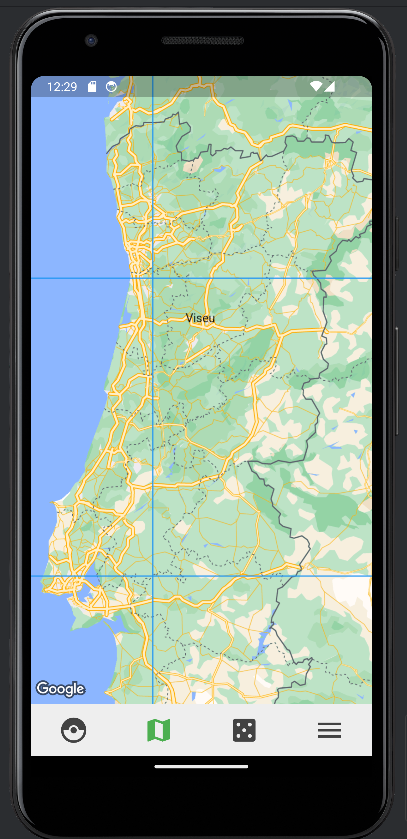

<!-- Template file for README.md for LEIC-ES-2023-24 -->

# _BioCatcher_ Development Report

Welcome to the documentation pages of the _BioCatcher_!

You can find here details about _BioCatcher_, from a high-level vision to low-level implementation decisions, a kind of Software Development Report, organized by type of activities: 

* [Business modeling](#Business-Modelling) 
  * [Product Vision](#Product-Vision)
  * [Features and Assumptions](#Features-and-Assumptions)
  * [Elevator Pitch](#Elevator-pitch)
* [Requirements](#Requirements)
  * [User stories](#User-stories)
  * [Domain model](#Domain-model)
* [Architecture and Design](#Architecture-And-Design)
  * [Logical architecture](#Logical-Architecture)
  * [Physical architecture](#Physical-Architecture)
  * [Vertical prototype](#Vertical-Prototype)
* [Project management](#Project-Management)

Made by:

 - Ismael Moniz - up202206871@up.pt
 - Gabriel Lima - up202206693@up.pt
 - Francisco Bettencourt - up202105288@up.pt
 - Francisco Fernandes - up202104843@up.pt
 - Luís Fiunte - up202208819@up.pt

---
## Business Modelling

### Product Vision

Discover, collect, and battle Portugal's native fauna in an exciting Pokémon-inspired app! Explore the diverse wildlife of Portugal while learning about its ecosystems. Challenge your friends to epic battles using the animals you've collected. Dive into fun and education with our app!

### Features and Assumptions

#### Features

- Login - Allows the user to keep their progress
- Battle - Allows the user to engage in battles between animals
- BioDex - Stores the user's animals and shows their characteristics
- Lootboxes - Box opening system to collect animals (gambling mechanic)
- Interactive map - Map of Portugal divided by regions where you can check their respective fauna and look up your completion for each region.
- Animal cards - Each animal has a card that gives information about their stats, level and general information about conservation status, average weight, longevity, etc.

#### Dependencies

- Firebase Store - Relational database service
- Firebase Authentication - Handles user criation and athentication
- Google Maps API - Used to display the map

### Elevator Pitch
Embark on an adventure to discover Portugal's rich biodiversity with BioCatcher, the app that turns our native fauna into an exciting journey. From the majestic iberian lynx to the slender lusitanian salamander, embark on quests to collect  and learn more about the creatures that hide in Portugal's forests, rivers and seas. But it's more than a game - it's a platform where everyone can learn and educate themselves about wildlife and contribute to conservation efforts while having fun! There are so many interesting animals to discover, come and start your journey now!

## Requirements

### User stories

[Go to board](https://github.com/orgs/FEUP-LEIC-ES-2023-24/projects/4/)

### Domain model

 

  

## Architecture and Design

### Logical architecture

None yet

### Physical architecture

None yet

  

### Vertical prototype

Our app main feature is being able to check a map and find out about region-specific animals.
As such, one of the main challanges is the implementation of this map and finding a way to write over it.

While at this phase only the label "Viseu" can be seen, it is possible to implement such concept and our current implementation allows us to put text in any tile, at a specific zoom.

 
 

## Project management
You can find below information and references related with the project management in our team: 

### Backlog management
- Product backlog and Sprint backlog in a [Github Projects board](https://github.com/orgs/FEUP-LEIC-ES-2023-24/projects/64);
### Release management
- [v0.0.1 (increment #0)](https://github.com/FEUP-LEIC-ES-2023-24/2LEIC05T4/releases/tag/v0.0.1);
- [v0.0.2 (increment #1)](https://github.com/FEUP-LEIC-ES-2023-24/2LEIC05T4/releases/tag/v0.0.2);
- [v0.0.3 (increment #2)](https://github.com/FEUP-LEIC-ES-2023-24/2LEIC05T4/releases/tag/v0.0.3);
- [v0.1.0 (Final increment / #3)](https://github.com/FEUP-LEIC-ES-2023-24/2LEIC05T4/releases/tag/v0.1.0);

### Sprint planning and retrospectives
> Clicking any image will open them in full size.
<table>
 <thead>
  <tr>
   <th rowspan=2>Sprint</th>
   <th colspan=2>Plans</th>
   <th rowspan=2>Retrospective</th>
  </tr>
  <tr>
   <th>Backlog before</th>
   <th>Backlog after</th>
  </tr>
 </thead>
 <tbody>
  <tr>
   <th>
    Sprint 0 (v0.0.1)
     
    <a href="https://github.com/FEUP-LEIC-ES-2023-24/2LEIC05T4/releases/tag/v0.0.1">Release</a>
   </th>
   <td>No board existed at this point.</td>
   <td>
    
   </td>
   <td>
    <ul>
     <li>System battle needs to be better defined.</li>
     <li>Sprint 1 will be focused in implementing the animal management and map view part of the app while we conceptualize the battle system.</li>
    </ul>
   </td>
  </tr>
  <tr>
   <th>
    Sprint 1 (v0.0.2)
     
    <a href="https://github.com/FEUP-LEIC-ES-2023-24/2LEIC05T4/releases/tag/v0.0.2">Release</a>
   </th>
   <td>
    
   </td>
   <td>
   </td>
   <td>
    <ul>
     <li>
      The focus for the next sprint will be to effectively divide the workload and put more hours towards the project.
      Additionally, we have to better divide workload and do it in a more timely manner.
     </li>
     <li>The goals for the next sprint are finishing up the account system, implementing lootboxes, finishing the storage system and fixing any existing issues with the current code.</li>
    </ul>
   </td>
  </tr>
  <tr>
   <th>
    Sprint 2 (v0.0.3)
     
    <a href="https://github.com/FEUP-LEIC-ES-2023-24/2LEIC05T4/releases/tag/v0.0.3">Release</a>
   </th>
   <td>
    
   </td>
   <td>
    
   </td>
   <td>
    <ul>
     <li>After this sprint, we must flesh out the combat system. Additionally, there is a need to focus in developing the map feature and adding the region labels to it.</li>
    </ul>
   </td>
  </tr>
  <tr>
   <th>
    Sprint 3 / Final Sprint (v0.1.0)
    <a href="https://github.com/FEUP-LEIC-ES-2023-24/2LEIC05T4/releases/tag/v0.1.0">Release</a>
   </th>
   <td>
    
   </td>
   <td>
    
   </td>
   <td>
    <ul>
     <li>Yet to be.</li>
    </ul>
   </td>
  </tr>
 </tbody>
</table>
